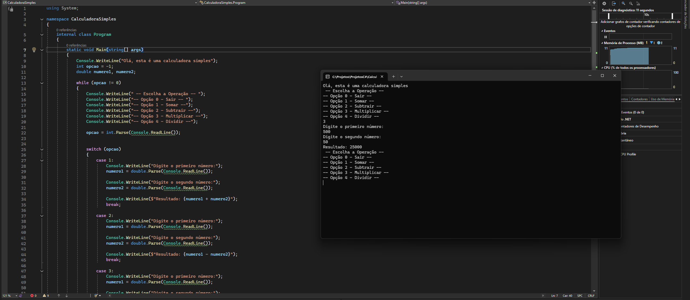

# 🧮 Calculadora Simples em C#



Uma calculadora de console desenvolvida em C# para realizar operações matemáticas básicas. Este projeto foi criado para praticar os fundamentos da linguagem e a estrutura de projetos .NET.

## 🚀 Funcionalidades

* Soma
* Subtração
* Multiplicação
* Divisão

## 🛠️ Tecnologias Utilizadas

* **Linguagem:** C#
* **Plataforma:** .NET Core / .NET SDK

## ⚙️ Como executar o projeto

1. Clone o repositório:
   ```bash
   git clone [https://github.com/lucasffarias95/Calculadora-console-csharp.git](https://github.com/lucasffarias95/Calculadora-console-csharp.git)
   ```
2. Entre na pasta do projeto:
   ```bash
    cd CalculadoraSimples
   ```
   
3. Execute o projeto:
   ```bash
   dotnet run
   ```
   
   Feito por Lucas Farias